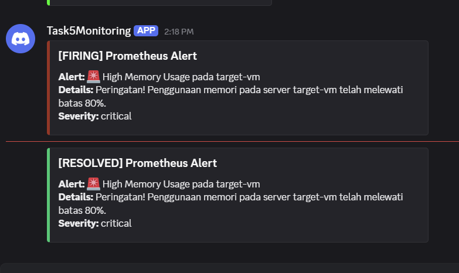
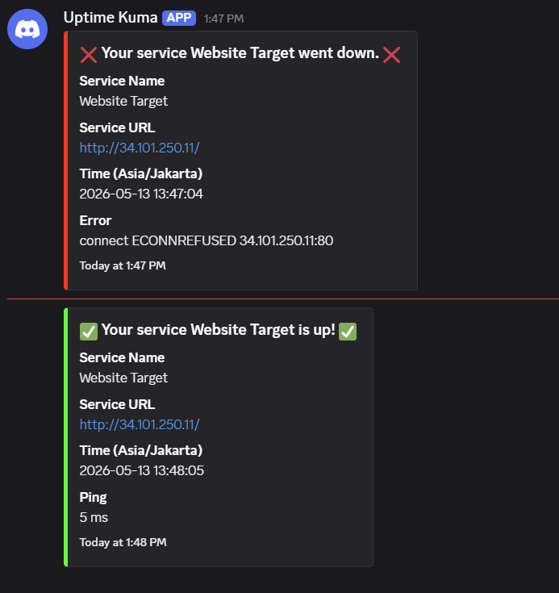

# Task5ManageDashboardMonitoring

A robust, dual-VM DevOps monitoring stack deployment on Google Cloud Platform (GCP) featuring a web server, complete observability (Prometheus & Grafana), and an automated Discord alerting system (Alertmanager & Uptime Kuma).

## 📸 Monitoring Results

Berikut adalah hasil nyata dari *alerting system* yang telah diimplementasikan:

### Prometheus / Alertmanager (High Memory Alert)


### Uptime Kuma (Web Downtime Alert)


---

## 🏗️ Architecture (Dual-VM Setup)

Demi menjaga stabilitas saat beban server sedang tinggi (stress test), arsitektur ini memisahkan layanan monitoring dari server target aplikasi.

```text
┌─────────────────────────────────────────────────────────────────┐
│                      GCP Compute Engine                         │
│                                                                 │
│  ┌─────────────────────────┐       ┌─────────────────────────┐  │
│  │     target-vm           │       │    monitoring-vm        │  │
│  │     (e2-micro)          │       │    (e2-small)           │  │
│  │                         │       │                         │  │
│  │ ┌─────────────────────┐ │       │ ┌─────────────────────┐ │  │
│  │ │      Nginx (80)     │ │ <───  │ │ Uptime Kuma (3001)  │ │  │
│  │ └─────────────────────┘ │       │ └─────────────────────┘ │  │
│  │                         │       │                         │  │
│  │ ┌─────────────────────┐ │       │ ┌─────────────────────┐ │  │
│  │ │ Node Exporter (9100)│ │ <───  │ │  Prometheus (9090)  │ │  │
│  │ └─────────────────────┘ │       │ └─────────────────────┘ │  │
│  └─────────────────────────┘       │          │              │  │
│                                    │          v              │  │
│                                    │ ┌─────────────────────┐ │  │
│                                    │ │ Alertmanager (9093) │ │  │
│                                    │ └─────────────────────┘ │  │
│                                    │          │              │  │
│                                    │          v              │  │
│                                    │   [ Discord Webhook ]   │  │
│                                    │                         │  │
│                                    │ ┌─────────────────────┐ │  │
│                                    │ │    Grafana (3000)   │ │  │
│                                    │ └─────────────────────┘ │  │
│                                    └─────────────────────────┘  │
└─────────────────────────────────────────────────────────────────┘
```

## 📦 Components

| Component | Port | VM | Description |
|-----------|------|----|-------------|
| **Nginx** | `80` | `target-vm` | Web server serving static HTML |
| **Node Exporter** | `9100` | `target-vm` | System hardware & OS metrics collection |
| **Prometheus** | `9090` | `monitoring-vm` | Time-series database & alerting rules engine |
| **Alertmanager** | `9093` | `monitoring-vm` | Alert routing & formatting to Discord |
| **Grafana** | `3000` | `monitoring-vm` | Visualization dashboards |
| **Uptime Kuma** | `3001` | `monitoring-vm` | HTTP health check & downtime alerts |

---

## 🚀 Deployment Guide (Step-by-Step for DevOps)

Panduan ini ditujukan bagi *DevOps Engineer* lain yang ingin menjalankan ulang (*reproduce*) infrastruktur ini dari nol.

### Step 1: Prerequisites
- **GCP Account** dengan *billing* aktif.
- **gcloud CLI** & **Terraform** terinstal di perangkat lokal Anda.
- **Discord Webhook URL** untuk menerima notifikasi.

### Step 2: Authenticate & Prepare GCP
```bash
# Login ke GCP
gcloud auth application-default login

# Pilih project GCP Anda (ubah YOUR_PROJECT_ID)
gcloud config set project YOUR_PROJECT_ID
gcloud services enable compute.googleapis.com
```

### Step 3: Configure Variables (HINDARI LEAK CREDENTIAL)
1. Buka folder `terraform/`.
2. Buat file `terraform.tfvars` (file ini otomatis diabaikan oleh `.gitignore` untuk keamanan).
3. Isi dengan konfigurasi spesifik Anda:
```hcl
project_id            = "YOUR_PROJECT_ID"
region                = "asia-southeast2"
zone                  = "asia-southeast2-a"
discord_webhook_url   = "https://discord.com/api/webhooks/xxxxx/yyyyy"
```

### Step 4: Provision Infrastructure
Jalankan perintah berikut untuk mengeksekusi Terraform. Proses ini akan membuat 2 VM, mengkonfigurasi IP Statis, membuka *Firewall Ports*, dan secara otomatis melakukan injeksi konfigurasi ke script `setup.sh`.
```bash
cd terraform
terraform init
terraform apply -auto-approve
```
> **Catatan:** Terraform Output akan memberikan IP Public dari `target-vm` dan `monitoring-vm`.

### Step 5: Post-Deployment Setup
Setelah infrastruktur berdiri (tunggu ~3 menit agar *startup script* selesai), Anda perlu mengonfigurasi UI:

**1. Konfigurasi Grafana:**
- Buka `http://<MONITORING_VM_IP>:3000` (User: `admin` / Pass: `admin123`)
- Buka **Connections > Data Sources > Add Prometheus**.
- Masukkan URL: `http://prometheus:9090`, lalu Save & Test.
- Buka **Dashboards > Import**. Masukkan ID `1860` (Node Exporter Full), pilih source Prometheus, dan Import.

**2. Konfigurasi Uptime Kuma:**
- Buka `http://<MONITORING_VM_IP>:3001` dan buat akun admin.
- Buka **Settings > Notifications**, lalu Setup **Discord** dengan webhook URL Anda. Jangan lupa di-Test.
- Tambahkan Monitor baru (tipe HTTP) dan arahkan ke `http://<TARGET_VM_IP>`. Centang opsi notifikasi Discord.

### Step 6: Verifikasi & Stress Testing
Masuk ke `target-vm` melalui SSH untuk melakukan simulasi:

**Test 1: Memori Penuh (Alertmanager)**
```bash
# Target VM akan menggunakan memori yang tinggi (melewati batas 80%)
stress --vm 1 --vm-bytes 850M --timeout 180s
```
> *Hasil yang diharapkan: Notifikasi `[FIRING] Prometheus Alert` muncul di Discord.*

**Test 2: Server Down (Uptime Kuma)**
```bash
sudo systemctl stop nginx
```
> *Hasil yang diharapkan: Notifikasi `[Target VM] [DOWN]` dari Uptime Kuma muncul di Discord.*

---

## 🛠️ Folder Structure
```text
.
├── terraform/
│   ├── main.tf           # Definisi 2-VM, static IP, template file injection
│   ├── variables.tf      # Deklarasi variabel
│   └── outputs.tf        # Output URL untuk diakses
├── monitoring/
│   ├── docker-compose.yml# Orkestrasi container monitoring
│   ├── prometheus.yml    # Scrape config
│   ├── alert.rules.yml   # Threshold CPU & Memory (80%)
│   └── alertmanager.yml  # Format notifikasi Discord (menggunakan discord_configs)
├── provisioning/
│   ├── setup.sh          # Script otomatisasi monitoring-vm
│   └── setup-target.sh   # Script otomatisasi target-vm (termasuk 1GB Swap)
└── web/
    └── index.html        # Halaman depan website
```

## 🔐 Security Notes
1. **Webhook Protection:** File `update_monitoring.sh` atau script apa pun yang mengandung *hardcoded URL Webhook* harus dihapus dari sistem sebelum di-*push* ke repositori publik. Parameter dilempar dengan aman via variabel Terraform.
2. **Default Password:** Harap segera mengganti password bawaan Grafana (`admin123`).
3. **Firewall:** Buka port secara spesifik, jangan gunakan `0.0.0.0/0` pada production *port* seperti 9090 jika tidak perlu.