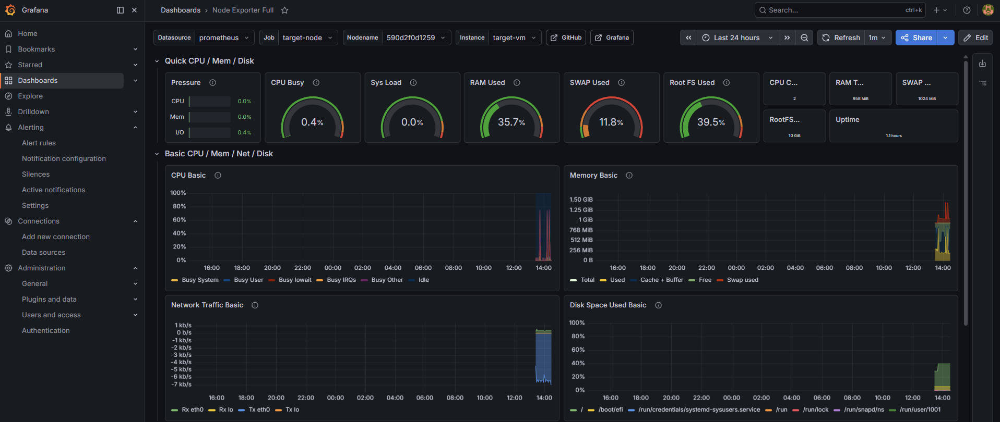
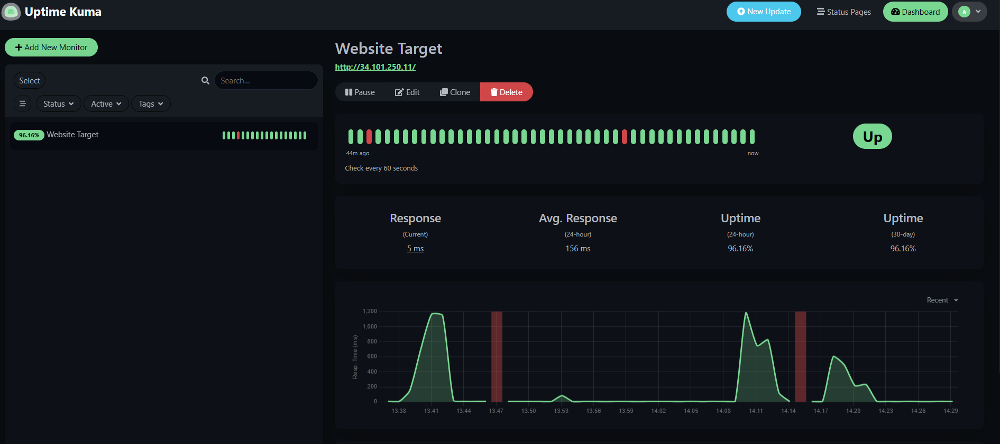
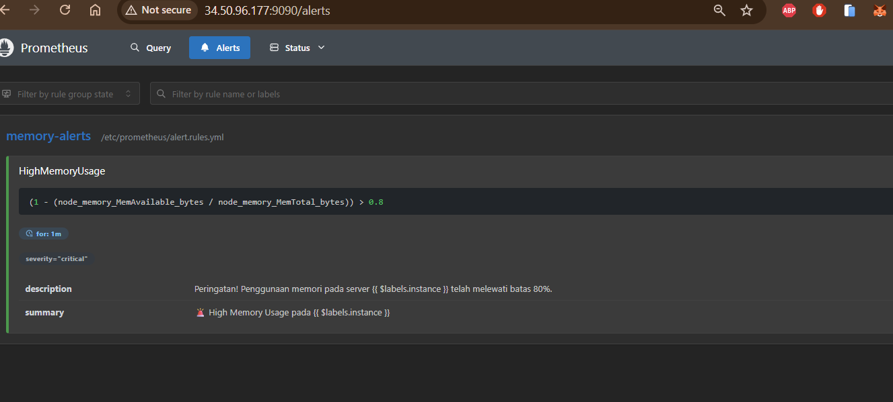

# Task5ManageDashboardMonitoring

A robust, platform-agnostic, dual-VM DevOps monitoring stack deployment featuring a web server, complete observability (Prometheus & Grafana), and an automated Discord alerting system (Alertmanager & Uptime Kuma).

> 💡 **Platform-Agnostic Design**: While this repository includes **Terraform scripts for GCP**, the core monitoring stack (Docker Compose, Bash Scripts, and Configuration YAMLs) can be deployed seamlessly on **AWS (EC2)**, **Azure (Virtual Machines)**, or any **On-Premise Ubuntu servers**.

---

## 📸 Monitoring Dashboards & Results

Berikut adalah hasil nyata dari *monitoring dashboard* dan *alerting system* yang telah diimplementasikan:

### 1. Grafana Dashboard (Node Exporter Full)


### 2. Uptime Kuma Dashboard (HTTP Status)


### 3. Prometheus Alerting Rules


### 4. Discord Alert Notifications (Firing & Resolved)


---

## 🏗️ Architecture (Dual-VM Setup)

Demi menjaga stabilitas saat beban server sedang tinggi (*stress test*), arsitektur ini memisahkan layanan monitoring dari server target aplikasi.

```text
┌─────────────────────────────────────────────────────────────────┐
│                      Cloud Provider (GCP/AWS/Azure)             │
│                                                                 │
│  ┌─────────────────────────┐       ┌─────────────────────────┐  │
│  │     target-vm           │       │    monitoring-vm        │  │
│  │     (1vCPU, 1GB RAM)    │       │    (1vCPU, 2GB RAM)     │  │
│  │                         │       │                         │  │
│  │ ┌─────────────────────┐ │       │ ┌─────────────────────┐ │  │
│  │ │      Nginx (80)     │ │ <───  │ │ Uptime Kuma (3001)  │ │  │
│  │ └─────────────────────┘ │       │ └─────────────────────┘ │  │
│  │                         │       │                         │  │
│  │ ┌─────────────────────┐ │       │ ┌─────────────────────┐ │  │
│  │ │ Node Exporter (9100)│ │ <───  │ │  Prometheus (9090)  │ │  │
│  │ └─────────────────────┘ │       │ └─────────────────────┘ │  │
│  └─────────────────────────┘       │          │              │  │
│                                    │          v              │  │
│                                    │ ┌─────────────────────┐ │  │
│                                    │ │ Alertmanager (9093) │ │  │
│                                    │ └─────────────────────┘ │  │
│                                    │          │              │  │
│                                    │          v              │  │
│                                    │   [ Discord Webhook ]   │  │
│                                    │                         │  │
│                                    │ ┌─────────────────────┐ │  │
│                                    │ │    Grafana (3000)   │ │  │
│                                    │ └─────────────────────┘ │  │
│                                    └─────────────────────────┘  │
└─────────────────────────────────────────────────────────────────┘
```

## 📦 Components

| Component | Port | VM | Description |
|-----------|------|----|-------------|
| **Nginx** | `80` | `target-vm` | Web server serving static HTML |
| **Node Exporter** | `9100` | `target-vm` | System hardware & OS metrics collection |
| **Prometheus** | `9090` | `monitoring-vm` | Time-series database & alerting rules engine |
| **Alertmanager** | `9093` | `monitoring-vm` | Alert routing & formatting to Discord |
| **Grafana** | `3000` | `monitoring-vm` | Visualization dashboards |
| **Uptime Kuma** | `3001` | `monitoring-vm` | HTTP health check & downtime alerts |

---

## 🚀 Deployment Guide (Step-by-Step)

Panduan ini dirancang agar *DevOps Engineer* dapat mereplikasi infrastruktur ini dari nol, baik di GCP maupun cloud provider lainnya.

### Opsi A: Deployment Otomatis menggunakan Terraform (Hanya untuk GCP)

Jika Anda menggunakan Google Cloud Platform, Anda dapat menjalankan *provisioning* secara otomatis 100%:

**1. Prerequisites:**
- **GCP Account** dengan *billing* aktif.
- **gcloud CLI** & **Terraform** terinstal.
- **Discord Webhook URL**.

**2. Setup & Eksekusi:**
```bash
# Login ke GCP
gcloud auth application-default login
gcloud config set project YOUR_PROJECT_ID
gcloud services enable compute.googleapis.com

# Setup Variabel (HINDARI LEAK CREDENTIAL)
cd terraform
cat <<EOF > terraform.tfvars
project_id            = "YOUR_PROJECT_ID"
region                = "asia-southeast2"
zone                  = "asia-southeast2-a"
discord_webhook_url   = "https://discord.com/api/webhooks/xxxxx/yyyyy"
EOF

# Deploy Infrastruktur
terraform init
terraform apply -auto-approve
```
> *Catatan: Terraform otomatis akan memanggil `setup.sh` dan `setup-target.sh`, serta melakukan injeksi IP dan URL Webhook dengan aman.*

---

### Opsi B: Deployment Manual pada Cloud Provider Lain (AWS / Azure / On-Premise)

Jika Anda menggunakan AWS EC2, Azure VM, atau VirtualBox, Anda dapat memanfaatkan script *provisioning* yang sudah tersedia.

**1. Siapkan 2 buah Virtual Machine (OS: Ubuntu 22.04+):**
- **VM 1 (`target-vm`)**: Minimal 1 vCPU, 1GB RAM. Pastikan Port `80` dan `9100` terbuka di Security Group / Firewall.
- **VM 2 (`monitoring-vm`)**: Minimal 1 vCPU, 2GB RAM. Pastikan Port `3000`, `3001`, dan `9090` terbuka.

**2. Setup `target-vm`:**
Copy script `provisioning/setup-target.sh` ke dalam `target-vm` dan jalankan sebagai root:
```bash
sudo bash setup-target.sh
```

**3. Setup `monitoring-vm`:**
- Edit script `provisioning/setup.sh` terlebih dahulu.
- Ganti tulisan `${target_vm_ip}` menjadi **IP Public/Private dari `target-vm`**.
- Ganti tulisan `${discord_webhook_url}` menjadi **URL Discord Webhook asli Anda**.
- Setelah disimpan, copy ke `monitoring-vm` dan jalankan:
```bash
sudo bash setup.sh
```

---

### Step 5: Post-Deployment UI Configuration
Setelah infrastruktur berdiri (tunggu ~3 menit agar Docker selesai men-download image), konfigurasikan UI berikut:

**1. Konfigurasi Grafana:**
- Buka `http://<MONITORING_VM_IP>:3000` (User: `admin` / Pass: `admin123`)
- Buka **Connections > Data Sources > Add Prometheus**.
- Masukkan URL: `http://prometheus:9090`, lalu Save & Test.
- Buka **Dashboards > Import**. Masukkan ID `1860` (Node Exporter Full), pilih source Prometheus, dan Import.

**2. Konfigurasi Uptime Kuma:**
- Buka `http://<MONITORING_VM_IP>:3001` dan buat akun admin.
- Buka **Settings > Notifications**, lalu Setup **Discord** dengan webhook URL Anda. Jangan lupa di-Test.
- Tambahkan Monitor baru (tipe HTTP) dan arahkan ke `http://<TARGET_VM_IP>`. Centang opsi notifikasi Discord.

---

## 🧪 Verifikasi & Stress Testing

Masuk ke `target-vm` melalui SSH untuk melakukan simulasi:

**Test 1: Memori Penuh (Alertmanager)**
```bash
# Target VM akan menggunakan memori yang tinggi (melewati batas 80%)
# Tidak akan crash (OOM Kill) karena sistem sudah dilengkapi 1GB Swap dari script setup.
stress --vm 1 --vm-bytes 850M --timeout 180s
```
> *Hasil yang diharapkan: Notifikasi `[FIRING] Prometheus Alert` muncul di Discord.*

**Test 2: Server Down (Uptime Kuma)**
```bash
sudo systemctl stop nginx
```
> *Hasil yang diharapkan: Notifikasi `[Target VM] [DOWN]` dari Uptime Kuma muncul di Discord.*

---

## 🛠️ Folder Structure
```text
.
├── terraform/
│   ├── main.tf           # Definisi 2-VM GCP, static IP, template file injection
│   ├── variables.tf      # Deklarasi variabel
│   └── outputs.tf        # Output URL untuk diakses
├── monitoring/
│   ├── docker-compose.yml# Orkestrasi container monitoring
│   ├── prometheus.yml    # Scrape config
│   ├── alert.rules.yml   # Threshold CPU & Memory (80%)
│   └── alertmanager.yml  # Format notifikasi Discord (menggunakan discord_configs)
├── provisioning/
│   ├── setup.sh          # Script otomatisasi monitoring-vm (Platform Agnostic)
│   └── setup-target.sh   # Script otomatisasi target-vm (Platform Agnostic)
└── web/
    └── index.html        # Halaman depan website
```

## 🔐 Security Notes
1. **Webhook Protection:** Parameter *Discord webhook* tidak boleh ada di dalam file `.yml` atau `.sh` yang di-commit ke Git. Injeksi rahasia dilakukan saat *runtime* (via Terraform `templatefile` atau modifikasi manual). File `terraform.tfvars` wajib di-*ignore*.
2. **Default Password:** Harap segera mengganti password bawaan Grafana (`admin123`).
3. **Firewall:** Buka port secara spesifik melalui *Security Groups* atau *VPC Firewall Rules*. Jangan gunakan `0.0.0.0/0` pada port sensitif jika memungkinkan batasi hanya dari IP kantor Anda.